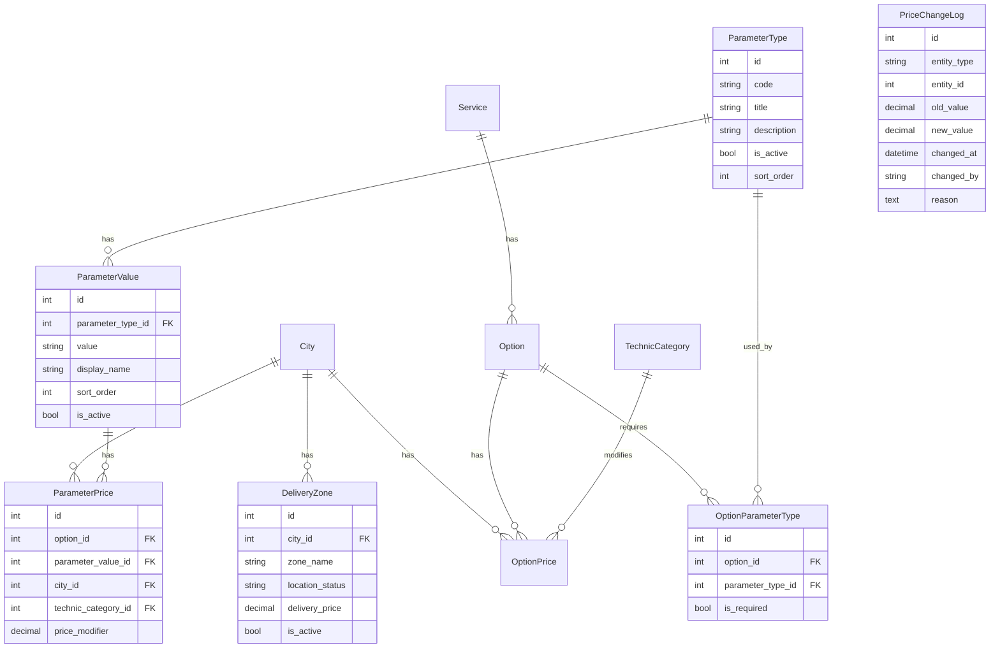

# Система ценообразования с динамическими параметрами

## Контекст проекта

**Что делаем:**

- Справочник с калькулятором цены на сайте
- **Полностью гибкая система параметров** — добавление любых типов параметров
- Опции могут быть с параметрами (переменная цена) или без (фиксированная цена)
- Совместимость с текущим API сайта

**Примеры использования:**

1. **Замена масла** → параметр "Тип масла" (Синтетика, Минеральное) → цена зависит от типа
2. **Шиномонтаж** → параметр "Радиус шины" (R13-R22) → цена зависит от радиуса
3. **Заправка топливом** → параметр "Тип топлива" (АИ-92, АИ-95) → цена зависит от топлива
4. **Эвакуатор** → без параметров → фиксированная цена (зависит только от города и зоны)

---

## Анализ текущих баз данных

### 1. База данных мобильного приложения (911_last.sql)

**Ключевые таблицы:**

| Таблица | Записей | Описание |

|---------|---------|----------|

| `city_db` | 7+ | Города (Махачкала, Каспийск...) |

| `service_db` | 4 | Услуги |

| `option_db` | 77 | Опции услуг |

| `option_price_db` | 200+ | Цены опций по городам |

| `order_condition_db` | 100+ | Модификаторы цен (radius, fuel_type) |

| `working_zone_db` | 50+ | Зоны доставки |

| `technic_category_db` | 10+ | Категории техники |

**Проблемы текущей реализации приложения:**

| Проблема | Описание | Решение |

|----------|----------|---------|

| Жесткие condition_type | Типы (radius, fuel_type) зашиты в коде | Динамический ParameterType |

| Дублирование данных | R13-R23 дублируются для каждой опции | Единая таблица ParameterValue |

| JSONB в заказах | conditions как JSON | Отдельные связи |

| Расчет на клиенте | Цена складывается в мобилке | API расчета на бэкенде |

| Нет истории | Изменения цен не сохраняются | PriceChangeLog |

### 2. База данных сайта (текущая)

**Существующие модели:**

```
website_api/models/
├── city.py          - City (города)
├── service.py       - Service (услуги)
├── option.py        - Option (опции услуг)
├── option_price.py  - OptionPrice (цены опций)
├── technic.py       - TechnicCategory (категории техники)
└── ... (остальные)
```

**Текущая структура OptionPrice:**

```python
class OptionPrice:
    option = ForeignKey(Option)
    city = ForeignKey(City)
    technic_category = ForeignKey(TechnicCategory, null=True)  # <-- только это!
    amount = DecimalField()
```

**Проблемы:**

1. ❌ Нет динамических параметров (только technic_category)
2. ❌ Нет зон доставки (in_city/out_city)
3. ❌ Нет модификаторов цен для параметров
4. ❌ Нет логирования изменений

---

## Новая архитектура БД (с динамическими параметрами)

### Схема таблиц



### Логика ценообразования

```
┌─────────────────────────────────────────────────────────────────┐
│ ОПЦИЯ БЕЗ ПАРАМЕТРОВ (has_parameters = False)                   │
│                                                                 │
│ total_price = OptionPrice.amount + DeliveryZone.delivery_price  │
│                                                                 │
│ Пример: Эвакуатор в Махачкале (за городом)                      │
│   = 2000 (базовая цена) + 1500 (выезд за город) = 3500 ₽       │
└─────────────────────────────────────────────────────────────────┘

┌─────────────────────────────────────────────────────────────────┐
│ ОПЦИЯ С ПАРАМЕТРАМИ (has_parameters = True)                     │
│                                                                 │
│ total_price = OptionPrice.amount (базовая цена)                 │
│             + sum(ParameterPrice.price_modifier)                │
│             + DeliveryZone.delivery_price                       │
│                                                                 │
│ Пример: Замена колеса R19 в Махачкале (в городе)                │
│   = 200 (база) + 500 (R19) + 0 (в городе) = 700 ₽              │
│                                                                 │
│ Пример: Замена масла (Синтетика 5W-40) в Махачкале              │
│   = 500 (база) + 300 (синтетика) + 0 (в городе) = 800 ₽        │
└─────────────────────────────────────────────────────────────────┘
```

---

## Новые модели Django

### 1. ParameterType (Типы параметров)

**Полная свобода добавления любых типов!**

```python
# website_api/models/parameter_type.py

class ParameterType(models.Model):
    """
    Динамический тип параметра.
    
    Примеры:
  - code='tire_radius', title='Радиус шины'
  - code='oil_type', title='Тип масла'
  - code='fuel_type', title='Тип топлива'
  - code='boom_height', title='Высота автовышки'
  - code='distance', title='Расстояние эвакуации'
    
    Вы можете добавлять ЛЮБЫЕ типы параметров через админку!
    """
    
    code = models.CharField(
        max_length=50,
        unique=True,
        verbose_name="Код параметра",
        help_text="Уникальный код, например: tire_radius, oil_type, fuel_type"
    )
    title = models.CharField(
        max_length=150,
        verbose_name="Название",
        help_text="Отображаемое название, например: 'Радиус шины', 'Тип масла'"
    )
    description = models.TextField(
        blank=True,
        verbose_name="Описание",
        help_text="Подсказка для пользователя при выборе"
    )
    sort_order = models.IntegerField(
        default=0,
        verbose_name="Порядок сортировки"
    )
    is_active = models.BooleanField(
        default=True,
        verbose_name="Активен"
    )
    created_at = models.DateTimeField(auto_now_add=True)
    updated_at = models.DateTimeField(auto_now=True)

    class Meta:
        db_table = "parameter_type"
        verbose_name = "Тип параметра"
        verbose_name_plural = "Типы параметров"
        ordering = ['sort_order', 'title']

    def __str__(self):
        return f"{self.title} ({self.code})"
```

### 2. ParameterValue (Значения параметров)

```python
# website_api/models/parameter_value.py

class ParameterValue(models.Model):
    """
    Значение параметра.
    
    Примеры:
  - parameter_type='tire_radius', value='R15', display_name='R15'
  - parameter_type='oil_type', value='synthetic_5w40', display_name='Синтетика 5W-40'
  - parameter_type='fuel_type', value='ai92', display_name='АИ-92'
    """
    
    parameter_type = models.ForeignKey(
        'ParameterType',
        on_delete=models.CASCADE,
        related_name='values',
        verbose_name="Тип параметра"
    )
    value = models.CharField(
        max_length=100,
        verbose_name="Значение",
        help_text="Техническое значение, например: R15, synthetic_5w40"
    )
    display_name = models.CharField(
        max_length=150,
        verbose_name="Отображаемое название",
        help_text="Название для пользователя, например: 'R15', 'Синтетика 5W-40'"
    )
    sort_order = models.IntegerField(
        default=0,
        verbose_name="Порядок сортировки"
    )
    is_active = models.BooleanField(
        default=True,
        verbose_name="Активно"
    )

    class Meta:
        db_table = "parameter_value"
        verbose_name = "Значение параметра"
        verbose_name_plural = "Значения параметров"
        ordering = ['parameter_type', 'sort_order']
        unique_together = ['parameter_type', 'value']

    def __str__(self):
        return f"{self.parameter_type.title}: {self.display_name}"
```

### 3. OptionParameterType (Связь опций с типами параметров)

```python
# website_api/models/option_parameter_type.py

class OptionParameterType(models.Model):
    """
    Связь опции с типом параметра.
    Определяет какие параметры нужны для расчета цены опции.
    
    Примеры:
  - Опция "Замена колеса" требует параметр "tire_radius"
  - Опция "Замена масла" требует параметр "oil_type"
  - Опция "Эвакуатор" — не требует параметров (фиксированная цена)
    """
    
    option = models.ForeignKey(
        'Option',
        on_delete=models.CASCADE,
        related_name='parameter_types',
        verbose_name="Опция"
    )
    parameter_type = models.ForeignKey(
        'ParameterType',
        on_delete=models.CASCADE,
        related_name='option_links',
        verbose_name="Тип параметра"
    )
    is_required = models.BooleanField(
        default=True,
        verbose_name="Обязательный",
        help_text="Если True, пользователь обязан выбрать значение этого параметра"
    )

    class Meta:
        db_table = "option_parameter_type"
        verbose_name = "Параметр опции"
        verbose_name_plural = "Параметры опций"
        unique_together = ['option', 'parameter_type']

    def __str__(self):
        return f"{self.option.title} → {self.parameter_type.title}"
```

### 4. ParameterPrice (Цена за значение параметра)

```python
# website_api/models/parameter_price.py

class ParameterPrice(models.Model):
    """
    Модификатор цены для конкретного значения параметра.
    
    Логика:
  - Если опция требует параметр, ищем ParameterPrice
  - Если ParameterPrice найден — используем price_modifier
  - Если не найден — параметр бесплатный (price_modifier = 0)
    
    Примеры:
  - option="Замена колеса", parameter_value="R19", city="Махачкала" → +500 ₽
  - option="Замена масла", parameter_value="Синтетика 5W-40", city="Махачкала" → +300 ₽
    """
    
    option = models.ForeignKey(
        'Option',
        on_delete=models.CASCADE,
        related_name='parameter_prices',
        verbose_name="Опция"
    )
    parameter_value = models.ForeignKey(
        'ParameterValue',
        on_delete=models.CASCADE,
        related_name='prices',
        verbose_name="Значение параметра"
    )
    city = models.ForeignKey(
        'City',
        on_delete=models.CASCADE,
        related_name='parameter_prices',
        verbose_name="Город"
    )
    technic_category = models.ForeignKey(
        'TechnicCategory',
        on_delete=models.SET_NULL,
        null=True,
        blank=True,
        related_name='parameter_prices',
        verbose_name="Категория техники",
        help_text="Если цена зависит от категории техники"
    )
    price_modifier = models.DecimalField(
        max_digits=10,
        decimal_places=2,
        default=0,
        verbose_name="Модификатор цены",
        help_text="Надбавка к базовой цене опции"
    )

    class Meta:
        db_table = "parameter_price"
        verbose_name = "Цена параметра"
        verbose_name_plural = "Цены параметров"
        unique_together = ['option', 'parameter_value', 'city', 'technic_category']
        indexes = [
            models.Index(fields=['option', 'city']),
            models.Index(fields=['parameter_value', 'city']),
        ]

    def __str__(self):
        tc = f" ({self.technic_category.title})" if self.technic_category else ""
        return f"{self.option.title} + {self.parameter_value.display_name} в {self.city.title}{tc}: +{self.price_modifier} ₽"
```

### 5. DeliveryZone (Зоны доставки)

```python
# website_api/models/delivery_zone.py

class DeliveryZone(models.Model):
    """
    Зона доставки с ценой выезда.
    
    location_status определяет тип зоны:
  - 'in_city' — в городе (обычно бесплатно или дешевле)
  - 'out_city' — за городом (дороже)
    """
    
    LOCATION_CHOICES = [
        ('in_city', 'В городе'),
        ('out_city', 'За городом'),
    ]
    
    city = models.ForeignKey(
        'City',
        on_delete=models.CASCADE,
        related_name='delivery_zones',
        verbose_name="Город"
    )
    zone_name = models.CharField(
        max_length=100,
        verbose_name="Название зоны",
        help_text="Например: 'В городе', 'За городом', 'Пригород'"
    )
    location_status = models.CharField(
        max_length=20,
        choices=LOCATION_CHOICES,
        verbose_name="Статус зоны"
    )
    delivery_price = models.DecimalField(
        max_digits=10,
        decimal_places=2,
        verbose_name="Цена выезда"
    )
    is_active = models.BooleanField(
        default=True,
        verbose_name="Активна"
    )

    class Meta:
        db_table = "delivery_zone"
        verbose_name = "Зона доставки"
        verbose_name_plural = "Зоны доставки"
        unique_together = ['city', 'location_status']

    def __str__(self):
        return f"{self.city.title} — {self.zone_name}: {self.delivery_price} ₽"
```

### 6. Обновление модели Option

```python
# website_api/models/option.py (ИЗМЕНЕНИЯ)

class Option(models.Model):
    """Опция услуги"""
    
    title = models.CharField(
        max_length=255,
        verbose_name="Название опции"
    )
    service = models.ForeignKey(
        'Service',
        on_delete=models.CASCADE,
        related_name='options',
        verbose_name="Услуга"
    )
    # НОВЫЕ ПОЛЯ:
    description = models.TextField(
        blank=True,
        verbose_name="Описание",
        help_text="Подробное описание опции для пользователя"
    )
    has_parameters = models.BooleanField(
        default=False,
        verbose_name="Есть параметры",
        help_text="Если True, цена зависит от выбранных параметров. "
                  "Если False, используется фиксированная цена из OptionPrice."
    )
    is_active = models.BooleanField(
        default=True,
        verbose_name="Активна"
    )

    class Meta:
        db_table = "option"
        verbose_name = "Опция"
        verbose_name_plural = "Опции"

    def __str__(self):
        return f"{self.title} ({self.service.title})"
    
    @property
    def required_parameter_types(self):
        """Возвращает типы параметров, которые требуются для этой опции"""
        return [
            link.parameter_type 
            for link in self.parameter_types.filter(is_required=True)
        ]
```

### 7. PriceChangeLog (Лог изменений цен)

```python
# website_api/models/price_change_log.py

class PriceChangeLog(models.Model):
    """
    Лог изменений цен для аудита.
    
    Записывается автоматически при изменении цен через админку.
    """
    
    ENTITY_TYPES = [
        ('OPTION_PRICE', 'Цена опции'),
        ('PARAMETER_PRICE', 'Цена параметра'),
        ('DELIVERY_ZONE', 'Зона доставки'),
    ]
    
    entity_type = models.CharField(
        max_length=50,
        choices=ENTITY_TYPES,
        verbose_name="Тип сущности"
    )
    entity_id = models.IntegerField(
        verbose_name="ID сущности"
    )
    entity_description = models.CharField(
        max_length=255,
        verbose_name="Описание сущности",
        help_text="Читаемое описание, что изменилось"
    )
    old_value = models.DecimalField(
        max_digits=10,
        decimal_places=2,
        null=True,
        blank=True,
        verbose_name="Старое значение"
    )
    new_value = models.DecimalField(
        max_digits=10,
        decimal_places=2,
        verbose_name="Новое значение"
    )
    changed_at = models.DateTimeField(
        auto_now_add=True,
        verbose_name="Дата изменения"
    )
    changed_by = models.CharField(
        max_length=150,
        verbose_name="Изменил",
        help_text="Email или имя пользователя"
    )
    reason = models.TextField(
        blank=True,
        verbose_name="Причина изменения"
    )

    class Meta:
        db_table = "price_change_log"
        verbose_name = "Лог изменения цены"
        verbose_name_plural = "Логи изменений цен"
        ordering = ['-changed_at']
        indexes = [
            models.Index(fields=['entity_type', 'entity_id']),
            models.Index(fields=['changed_at']),
        ]

    def __str__(self):
        return f"{self.entity_description}: {self.old_value} → {self.new_value} ({self.changed_at})"
```

---

## Формула расчета цены

```python
def calculate_price(
    option_id: int,
    city_id: int,
    technic_category_id: int = None,
    parameter_values: dict = None,  # {parameter_type_code: parameter_value_id}
    delivery_zone_id: int = None
) -> dict:
    """
    Расчет итоговой цены.
    
    Args:
        option_id: ID опции
        city_id: ID города
        technic_category_id: ID категории техники (опционально)
        parameter_values: словарь {код_типа_параметра: id_значения} (опционально)
        delivery_zone_id: ID зоны доставки (опционально)
    
    Returns:
        {
            "base_price": 200,
            "parameters_price": 500,
            "delivery_price": 1000,
            "total_price": 1700,
            "breakdown": [
                {"type": "base", "label": "Замена колеса", "amount": 200},
                {"type": "parameter", "label": "Радиус R19", "amount": 500},
                {"type": "delivery", "label": "За городом", "amount": 1000}
            ]
        }
    """
    
    option = Option.objects.get(id=option_id)
    city = City.objects.get(id=city_id)
    
    breakdown = []
    
    # 1. Базовая цена опции
    option_price_query = OptionPrice.objects.filter(option=option, city=city)
    if technic_category_id:
        option_price_query = option_price_query.filter(technic_category_id=technic_category_id)
    else:
        option_price_query = option_price_query.filter(technic_category__isnull=True)
    
    option_price = option_price_query.first()
    base_price = option_price.amount if option_price else Decimal('0')
    
    breakdown.append({
        "type": "base",
        "label": option.title,
        "amount": str(base_price)
    })
    
    # 2. Модификаторы параметров (если опция имеет параметры)
    parameters_price = Decimal('0')
    
    if option.has_parameters and parameter_values:
        for param_type_code, param_value_id in parameter_values.items():
            param_price = ParameterPrice.objects.filter(
                option=option,
                parameter_value_id=param_value_id,
                city=city
            )
            if technic_category_id:
                param_price = param_price.filter(technic_category_id=technic_category_id)
            else:
                param_price = param_price.filter(technic_category__isnull=True)
            
            param_price = param_price.first()
            
            if param_price:
                parameters_price += param_price.price_modifier
                
                param_value = ParameterValue.objects.get(id=param_value_id)
                breakdown.append({
                    "type": "parameter",
                    "label": param_value.display_name,
                    "amount": str(param_price.price_modifier)
                })
    
    # 3. Цена доставки (если указана зона)
    delivery_price = Decimal('0')
    
    if delivery_zone_id:
        delivery_zone = DeliveryZone.objects.filter(
            id=delivery_zone_id,
            city=city,
            is_active=True
        ).first()
        
        if delivery_zone:
            delivery_price = delivery_zone.delivery_price
            breakdown.append({
                "type": "delivery",
                "label": delivery_zone.zone_name,
                "amount": str(delivery_price)
            })
    
    # Итого
    total_price = base_price + parameters_price + delivery_price
    
    return {
        "base_price": str(base_price),
        "parameters_price": str(parameters_price),
        "delivery_price": str(delivery_price),
        "total_price": str(total_price),
        "breakdown": breakdown
    }
```

---

## API Endpoints

### Существующие endpoints (СОХРАНЯЮТСЯ, обратная совместимость)

| Endpoint | Метод | Описание | Изменения |

|----------|-------|----------|-----------|

| `/api/website/cities/` | GET | Список городов | + delivery_zones |

| `/api/website/cities/{slug}/` | GET | Детали города | + delivery_zones |

| `/api/website/services/` | GET | Список услуг | Без изменений |

| `/api/website/services/{slug}/` | GET | Детали услуги | Без изменений |

| `/api/website/services/{slug}/options/` | GET | Опции услуги | + has_parameters, parameter_types |

| `/api/website/options/` | GET | Список опций | + has_parameters, parameter_types |

| `/api/website/options/{id}/` | GET | Детали опции | + has_parameters, parameter_types, parameter_prices |

| `/api/website/options/by-city/` | GET | Опции по городу | + has_parameters, parameter_types |

| `/api/website/technic-categories/` | GET | Категории техники | Без изменений |

| `/api/website/cities/{city}/services/{service}/` | GET | Услуга в городе | + delivery_zones, parameter info |

| `/api/website/cities/{city}/services/{service}/options/` | GET | Опции услуги в городе | + has_parameters, parameter_types |

### Новые endpoints (pricing)

| Endpoint | Метод | Описание |

|----------|-------|----------|

| `/api/pricing/parameter-types/` | GET | Список типов параметров |

| `/api/pricing/parameter-types/{code}/values/` | GET | Значения параметра |

| `/api/pricing/cities/{city_id}/delivery-zones/` | GET | Зоны доставки в городе |

| `/api/pricing/calculate/` | POST | Расчет цены |

### Примеры запросов

#### GET /api/pricing/parameter-types/

```json
{
    "count": 3,
    "next": null,
    "previous": null,
    "results": [
        {
            "id": 1,
            "code": "tire_radius",
            "title": "Радиус шины",
            "description": "Выберите радиус колеса",
            "values_count": 10
        },
        {
            "id": 2,
            "code": "oil_type",
            "title": "Тип масла",
            "description": "Выберите тип масла для замены",
            "values_count": 5
        },
        {
            "id": 3,
            "code": "fuel_type",
            "title": "Тип топлива",
            "description": "Выберите тип топлива",
            "values_count": 4
        }
    ]
}
```

#### GET /api/pricing/parameter-types/tire_radius/values/

```json
{
    "count": 10,
    "next": null,
    "previous": null,
    "results": [
        {"id": 1, "value": "R13", "display_name": "R13", "sort_order": 1},
        {"id": 2, "value": "R14", "display_name": "R14", "sort_order": 2},
        {"id": 3, "value": "R15", "display_name": "R15", "sort_order": 3},
        {"id": 4, "value": "R16", "display_name": "R16", "sort_order": 4},
        {"id": 5, "value": "R17", "display_name": "R17", "sort_order": 5},
        {"id": 6, "value": "R18", "display_name": "R18", "sort_order": 6},
        {"id": 7, "value": "R19", "display_name": "R19", "sort_order": 7},
        {"id": 8, "value": "R20", "display_name": "R20", "sort_order": 8},
        {"id": 9, "value": "R21", "display_name": "R21", "sort_order": 9},
        {"id": 10, "value": "R22", "display_name": "R22", "sort_order": 10}
    ]
}
```

#### GET /api/pricing/cities/1/delivery-zones/

```json
{
    "count": 2,
    "next": null,
    "previous": null,
    "results": [
        {
            "id": 1,
            "zone_name": "В городе",
            "location_status": "in_city",
            "delivery_price": "0.00"
        },
        {
            "id": 2,
            "zone_name": "За городом",
            "location_status": "out_city",
            "delivery_price": "1500.00"
        }
    ]
}
```

#### POST /api/pricing/calculate/

**Запрос:**

```json
{
    "option_id": 1,
    "city_id": 1,
    "technic_category_id": null,
    "parameter_values": {
        "tire_radius": 7
    },
    "delivery_zone_id": 2
}
```

**Ответ:**

```json
{
    "base_price": "200.00",
    "parameters_price": "500.00",
    "delivery_price": "1500.00",
    "total_price": "2200.00",
    "breakdown": [
        {"type": "base", "label": "Замена колеса", "amount": "200.00"},
        {"type": "parameter", "label": "R19", "amount": "500.00"},
        {"type": "delivery", "label": "За городом", "amount": "1500.00"}
    ]
}
```

---

## Обновленные сериализаторы

### OptionListSerializer (обновленный)

```python
class OptionListSerializer(serializers.ModelSerializer):
    """Lightweight serializer for option lists"""
    service_title = serializers.CharField(source='service.title', read_only=True)
    service_slug = serializers.CharField(source='service.slug', read_only=True)
    has_parameters = serializers.BooleanField(read_only=True)
    parameter_types = serializers.SerializerMethodField()
    
    class Meta:
        model = Option
        fields = [
            'id', 'title', 'description', 'service_id', 'service_title', 
            'service_slug', 'has_parameters', 'parameter_types', 'is_active'
        ]
    
    def get_parameter_types(self, obj):
        """Возвращает типы параметров, если они есть"""
        if not obj.has_parameters:
            return []
        
        return [
            {
                "code": link.parameter_type.code,
                "title": link.parameter_type.title,
                "is_required": link.is_required
            }
            for link in obj.parameter_types.filter(
                parameter_type__is_active=True
            ).select_related('parameter_type')
        ]
```

### OptionWithCityPriceSerializer (обновленный)

```python
class OptionWithCityPriceSerializer(serializers.ModelSerializer):
    """Option with prices for specific city"""
    service_title = serializers.CharField(source='service.title', read_only=True)
    service_slug = serializers.CharField(source='service.slug', read_only=True)
    has_parameters = serializers.BooleanField(read_only=True)
    parameter_types = serializers.SerializerMethodField()
    prices = serializers.SerializerMethodField()
    parameter_prices = serializers.SerializerMethodField()
    
    class Meta:
        model = Option
        fields = [
            'id', 'title', 'description', 'service_id', 'service_title',
            'service_slug', 'has_parameters', 'parameter_types',
            'prices', 'parameter_prices', 'is_active'
        ]
    
    def get_parameter_types(self, obj):
        if not obj.has_parameters:
            return []
        
        result = []
        city = self.context.get('city')
        
        for link in obj.parameter_types.filter(
            parameter_type__is_active=True
        ).select_related('parameter_type'):
            param_type = link.parameter_type
            
            # Получаем значения с ценами для этого города
            values = []
            for value in param_type.values.filter(is_active=True).order_by('sort_order'):
                price_modifier = "0.00"
                if city:
                    param_price = ParameterPrice.objects.filter(
                        option=obj,
                        parameter_value=value,
                        city=city
                    ).first()
                    if param_price:
                        price_modifier = str(param_price.price_modifier)
                
                values.append({
                    "id": value.id,
                    "value": value.value,
                    "display_name": value.display_name,
                    "price_modifier": price_modifier
                })
            
            result.append({
                "code": param_type.code,
                "title": param_type.title,
                "is_required": link.is_required,
                "values": values
            })
        
        return result
    
    def get_prices(self, obj):
        """Базовые цены опции (без параметров)"""
        city = self.context.get('city')
        technic_category = self.context.get('technic_category')
        
        if not city:
            return []
        
        prices = obj.prices.filter(city=city).select_related('technic_category')
        
        if technic_category:
            prices = prices.filter(technic_category=technic_category)
        
        return [
            {
                'amount': str(price.amount),
                'technic_category': price.technic_category.title if price.technic_category else None
            }
            for price in prices
        ]
    
    def get_parameter_prices(self, obj):
        """Цены параметров (если есть)"""
        if not obj.has_parameters:
            return []
        
        city = self.context.get('city')
        if not city:
            return []
        
        # Группируем по типу параметра
        result = {}
        
        for param_price in obj.parameter_prices.filter(
            city=city
        ).select_related('parameter_value', 'parameter_value__parameter_type'):
            param_type_code = param_price.parameter_value.parameter_type.code
            
            if param_type_code not in result:
                result[param_type_code] = []
            
            result[param_type_code].append({
                "value_id": param_price.parameter_value.id,
                "display_name": param_price.parameter_value.display_name,
                "price_modifier": str(param_price.price_modifier)
            })
        
        return result
```

### CitySerializer (обновленный)

```python
class CityDetailSerializer(serializers.ModelSerializer):
    """Detailed city serializer with delivery zones"""
    delivery_zones = serializers.SerializerMethodField()
    
    class Meta:
        model = City
        fields = ['id', 'title', 'slug', 'is_active', 'delivery_zones']
    
    def get_delivery_zones(self, obj):
        zones = obj.delivery_zones.filter(is_active=True)
        return [
            {
                "id": zone.id,
                "zone_name": zone.zone_name,
                "location_status": zone.location_status,
                "delivery_price": str(zone.delivery_price)
            }
            for zone in zones
        ]
```

---

## Пагинация

Все endpoints используют **LimitOffset пагинацию** через `OptionalLimitOffsetPagination`:

```
GET /api/website/options/?limit=10&offset=0
```

**Ответ:**

```json
{
    "count": 77,
    "next": "http://api.example.com/api/website/options/?limit=10&offset=10",
    "previous": null,
    "results": [...]
}
```

Если `limit` и `offset` не указаны — возвращаются все записи.

---

## In-Memory кэш

```python
# website_api/cache.py

from datetime import datetime, timedelta
from typing import Dict, Any, Optional
from django.conf import settings


class PricingCache:
    """
    In-memory кэш для данных ценообразования.
    
    Хранит:
  - Типы параметров
  - Значения параметров
  - Зоны доставки
    
    Автоматически обновляется при изменениях в админке.
    """
    
    def __init__(self, ttl_minutes: int = 60):
        self._cache: Dict[str, Any] = {}
        self._last_update: Dict[str, datetime] = {}
        self._ttl = timedelta(minutes=ttl_minutes)
    
    def _is_expired(self, key: str) -> bool:
        if key not in self._last_update:
            return True
        return datetime.now() - self._last_update[key] > self._ttl
    
    def get(self, key: str) -> Optional[Any]:
        if self._is_expired(key):
            return None
        return self._cache.get(key)
    
    def set(self, key: str, value: Any) -> None:
        self._cache[key] = value
        self._last_update[key] = datetime.now()
    
    def invalidate(self, key: str = None) -> None:
        """Очистить кэш (весь или конкретный ключ)"""
        if key:
            self._cache.pop(key, None)
            self._last_update.pop(key, None)
        else:
            self._cache.clear()
            self._last_update.clear()
    
    def get_parameter_types(self):
        """Получить все типы параметров"""
        key = 'parameter_types'
        cached = self.get(key)
        if cached:
            return cached
        
        from website_api.models import ParameterType
        data = list(ParameterType.objects.filter(
            is_active=True
        ).prefetch_related('values'))
        self.set(key, data)
        return data
    
    def get_delivery_zones(self, city_id: int):
        """Получить зоны доставки для города"""
        key = f'delivery_zones_{city_id}'
        cached = self.get(key)
        if cached:
            return cached
        
        from website_api.models import DeliveryZone
        data = list(DeliveryZone.objects.filter(
            city_id=city_id,
            is_active=True
        ))
        self.set(key, data)
        return data


# Singleton
pricing_cache = PricingCache(ttl_minutes=60)
```

---

## Админ-панель с логированием

```python
# website_api/admin/option_price.py

from django.contrib import admin
from django.contrib.admin import SimpleListFilter
from website_api.models import OptionPrice, ParameterPrice, DeliveryZone, PriceChangeLog
from website_api.cache import pricing_cache


class OptionPriceAdmin(admin.ModelAdmin):
    list_display = ['option', 'city', 'technic_category', 'amount']
    list_filter = ['city', 'option__service']
    search_fields = ['option__title', 'city__title']
    
    def save_model(self, request, obj, form, change):
        # Логируем изменение
        if change:
            old_obj = OptionPrice.objects.get(pk=obj.pk)
            if old_obj.amount != obj.amount:
                PriceChangeLog.objects.create(
                    entity_type='OPTION_PRICE',
                    entity_id=obj.pk,
                    entity_description=str(obj),
                    old_value=old_obj.amount,
                    new_value=obj.amount,
                    changed_by=request.user.email or request.user.username,
                )
        else:
            PriceChangeLog.objects.create(
                entity_type='OPTION_PRICE',
                entity_id=obj.pk,
                entity_description=str(obj),
                old_value=None,
                new_value=obj.amount,
                changed_by=request.user.email or request.user.username,
            )
        
        super().save_model(request, obj, form, change)
        
        # Инвалидируем кэш
        pricing_cache.invalidate()


class ParameterPriceAdmin(admin.ModelAdmin):
    list_display = ['option', 'parameter_value', 'city', 'technic_category', 'price_modifier']
    list_filter = ['city', 'option__service', 'parameter_value__parameter_type']
    search_fields = ['option__title', 'parameter_value__display_name']
    
    def save_model(self, request, obj, form, change):
        if change:
            old_obj = ParameterPrice.objects.get(pk=obj.pk)
            if old_obj.price_modifier != obj.price_modifier:
                PriceChangeLog.objects.create(
                    entity_type='PARAMETER_PRICE',
                    entity_id=obj.pk,
                    entity_description=str(obj),
                    old_value=old_obj.price_modifier,
                    new_value=obj.price_modifier,
                    changed_by=request.user.email or request.user.username,
                )
        
        super().save_model(request, obj, form, change)
        pricing_cache.invalidate()


class DeliveryZoneAdmin(admin.ModelAdmin):
    list_display = ['city', 'zone_name', 'location_status', 'delivery_price', 'is_active']
    list_filter = ['city', 'location_status', 'is_active']
    
    def save_model(self, request, obj, form, change):
        if change:
            old_obj = DeliveryZone.objects.get(pk=obj.pk)
            if old_obj.delivery_price != obj.delivery_price:
                PriceChangeLog.objects.create(
                    entity_type='DELIVERY_ZONE',
                    entity_id=obj.pk,
                    entity_description=str(obj),
                    old_value=old_obj.delivery_price,
                    new_value=obj.delivery_price,
                    changed_by=request.user.email or request.user.username,
                )
        
        super().save_model(request, obj, form, change)
        pricing_cache.invalidate(f'delivery_zones_{obj.city_id}')


class PriceChangeLogAdmin(admin.ModelAdmin):
    list_display = ['entity_description', 'old_value', 'new_value', 'changed_at', 'changed_by']
    list_filter = ['entity_type', 'changed_at']
    search_fields = ['entity_description', 'changed_by']
    readonly_fields = ['entity_type', 'entity_id', 'entity_description', 
                       'old_value', 'new_value', 'changed_at', 'changed_by', 'reason']
    
    def has_add_permission(self, request):
        return False
    
    def has_change_permission(self, request, obj=None):
        return False
    
    def has_delete_permission(self, request, obj=None):
        return False
```

---

## Валидация цен

```python
# website_api/validators.py

from decimal import Decimal
from django.core.exceptions import ValidationError

MIN_PRICE = Decimal('0')
MAX_PRICE = Decimal('1000000')


def validate_price(value):
    """Валидация цены"""
    if value < MIN_PRICE:
        raise ValidationError(f'Цена не может быть отрицательной')
    if value > MAX_PRICE:
        raise ValidationError(f'Цена не может быть больше {MAX_PRICE}')
    return value


def validate_price_modifier(value):
    """Валидация модификатора цены (может быть отрицательным для скидок)"""
    if value < -MAX_PRICE:
        raise ValidationError(f'Модификатор не может быть меньше -{MAX_PRICE}')
    if value > MAX_PRICE:
        raise ValidationError(f'Модификатор не может быть больше {MAX_PRICE}')
    return value
```

---

## План реализации

### Фаза 1: БД и модели (3-4 дня)

1. ✅ Создать документацию `docs/DATABASE_ANALYSIS.md`
2. Создать модели:

                        - ParameterType
                        - ParameterValue
                        - OptionParameterType
                        - ParameterPrice
                        - DeliveryZone
                        - PriceChangeLog

3. Обновить модель Option (добавить has_parameters, description)
4. Создать и применить миграции

### Фаза 2: Сериализаторы и API (2-3 дня)

1. Обновить существующие сериализаторы
2. Создать сериализаторы для новых моделей
3. Создать новые endpoints `/api/pricing/`
4. Реализовать POST /api/pricing/calculate/

### Фаза 3: Кэш и валидация (1-2 дня)

1. Реализовать PricingCache
2. Добавить валидацию цен
3. Интегрировать кэш с views

### Фаза 4: Админ-панель (2 дня)

1. Создать админ для новых моделей
2. Добавить автоматическое логирование изменений
3. Добавить инлайны для удобного редактирования

### Фаза 5: Импорт данных и документация (2-3 дня)

1. Создать management команды для импорта из дампа
2. Создать fixtures с тестовыми данными
3. Написать документацию для фронтенда
4. Написать документацию для бэкендера по импорту

---

## Документация для фронтенда

См. отдельный файл: `docs/FRONTEND_API_CHANGES.md`

## Документация для бэкендера по импорту данных

См. отдельный файл: `docs/BACKEND_DATA_IMPORT.md`

---

## Примеры использования

### Пример 1: Опция без параметров (Эвакуатор)

**Админка:**

```
Option:
 - title: "Эвакуатор"
 - service: "Эвакуация"
 - has_parameters: False

OptionPrice:
 - option: "Эвакуатор"
 - city: "Махачкала"
 - amount: 2500
```

**API Response:**

```json
{
    "id": 1,
    "title": "Эвакуатор",
    "has_parameters": false,
    "parameter_types": [],
    "prices": [{"amount": "2500.00", "technic_category": null}]
}
```

### Пример 2: Опция с параметрами (Замена колеса)

**Админка:**

```
ParameterType:
 - code: "tire_radius"
 - title: "Радиус шины"

ParameterValue:
 - parameter_type: "tire_radius"
 - value: "R15", display_name: "R15"
 - value: "R19", display_name: "R19"

Option:
 - title: "Замена колеса"
 - service: "Шиномонтаж"
 - has_parameters: True

OptionParameterType:
 - option: "Замена колеса"
 - parameter_type: "tire_radius"
 - is_required: True

OptionPrice:
 - option: "Замена колеса"
 - city: "Махачкала"
 - amount: 200  # Базовая цена

ParameterPrice:
 - option: "Замена колеса"
 - parameter_value: "R15"
 - city: "Махачкала"
 - price_modifier: 0  # R15 бесплатно

ParameterPrice:
 - option: "Замена колеса"
 - parameter_value: "R19"
 - city: "Махачкала"
 - price_modifier: 500  # R19 +500 ₽
```

**API Response:**

```json
{
    "id": 2,
    "title": "Замена колеса",
    "has_parameters": true,
    "parameter_types": [
        {
            "code": "tire_radius",
            "title": "Радиус шины",
            "is_required": true,
            "values": [
                {"id": 1, "value": "R15", "display_name": "R15", "price_modifier": "0.00"},
                {"id": 2, "value": "R19", "display_name": "R19", "price_modifier": "500.00"}
            ]
        }
    ],
    "prices": [{"amount": "200.00", "technic_category": null}]
}
```

### Пример 3: Услуга "Замена масла" с типами масла

**Админка:**

```
ParameterType:
 - code: "oil_type"
 - title: "Тип масла"

ParameterValue:
 - parameter_type: "oil_type"
 - value: "synthetic_5w40", display_name: "Синтетика 5W-40"
 - value: "mineral", display_name: "Минеральное"

Option:
 - title: "Замена масла"
 - service: "Техобслуживание"
 - has_parameters: True

OptionParameterType:
 - option: "Замена масла"
 - parameter_type: "oil_type"
 - is_required: True

OptionPrice:
 - option: "Замена масла"
 - city: "Махачкала"
 - amount: 500  # Базовая цена (работа)

ParameterPrice:
 - option: "Замена масла"
 - parameter_value: "synthetic_5w40"
 - city: "Махачкала"
 - price_modifier: 800  # Синтетика +800 ₽

ParameterPrice:
 - option: "Замена масла"
 - parameter_value: "mineral"
 - city: "Махачкала"
 - price_modifier: 400  # Минеральное +400 ₽
```

---

## Чек-лист MVP

- [ ] Модели созданы и мигрированы
                - [ ] ParameterType
                - [ ] ParameterValue
                - [ ] OptionParameterType
                - [ ] ParameterPrice
                - [ ] DeliveryZone
                - [ ] PriceChangeLog
                - [ ] Option обновлена (has_parameters, description)
- [ ] Существующие API обновлены (обратная совместимость)
- [ ] Новые API созданы
                - [ ] GET /api/pricing/parameter-types/
                - [ ] GET /api/pricing/parameter-types/{code}/values/
                - [ ] GET /api/pricing/cities/{id}/delivery-zones/
                - [ ] POST /api/pricing/calculate/
- [ ] PricingCache реализован
- [ ] Валидация цен реализована
- [ ] Админ-панель обновлена с логированием
- [ ] Документация для фронтенда создана
- [ ] Документация для бэкендера по импорту создана
- [ ] Fixtures с данными из дампа созданы

---

## Оценка

- **Сложность:** Средняя-Высокая
- **Время разработки:** 2-3 недели
- **Масштабируемость:** До 100000 пользователей в день