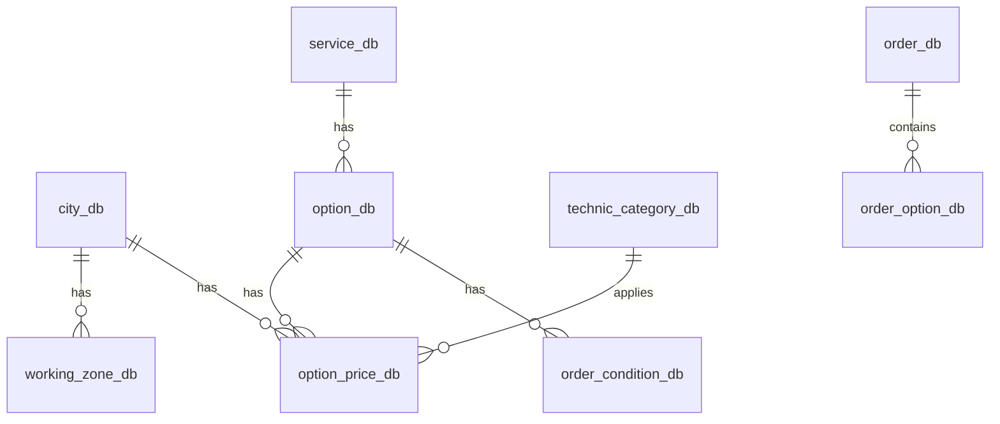
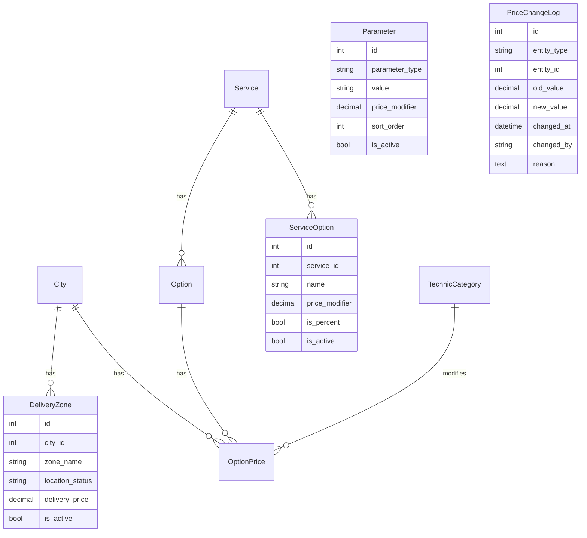

# Система ценообразования для сайта-справочника

## Контекст проекта

**Что делаем:**

- Справочник с калькулятором цены на сайте
- Пользователи видят примерные цены
- Кнопка "Заказать" для отправки заявки

**Что НЕ делаем (пока):**

- Систему управления заказами
- A/B тестирование цен
- Микросервисную архитектуру
- Multi-tenant систему

---

## Анализ текущих баз данных

### 1. База данных мобильного приложения (911_last.sql)

**Ключевые таблицы:**



**Структура таблиц:**

| Таблица | Описание | Поля |

|---------|----------|------|

| `city_db` | Города | id, title |

| `service_db` | Услуги (4 шт) | id, title |

| `option_db` | Опции услуг (77 шт) | id, title, service_id |

| `option_price_db` | Цены опций | id, amount, city_id, option_id, technic_category_id |

| `order_condition_db` | Модификаторы цен | id, title, condition_type, additional_price, option_id |

| `working_zone_db` | Зоны доставки | id, title, area_coordinates, departure_price, location_status, city_id |

| `technic_category_db` | Категории техники | id, title |

**Проблемы текущей реализации приложения:**

1. **Жесткая привязка condition_type** - типы (radius, fuel_type, volume, hours) зашиты в коде
2. **Дублирование данных** - радиусы R13-R23 дублируются для каждой опции
3. **JSONB в заказах** - conditions хранятся как JSON вместо отдельных таблиц
4. **Расчет на клиенте** - цена складывается в мобильном приложении
5. **Нет версионирования** - история изменений цен не сохраняется

### 2. База данных сайта (текущая)

**Модели:**

- [`website_api/models/city.py`](website_api/models/city.py) - City
- [`website_api/models/service.py`](website_api/models/service.py) - Service
- [`website_api/models/option.py`](website_api/models/option.py) - Option
- [`website_api/models/option_price.py`](website_api/models/option_price.py) - OptionPrice
- [`website_api/models/technic.py`](website_api/models/technic.py) - TechnicCategory

**Проблемы:**

1. **Нет зон доставки** - отсутствует модель для departure_price
2. **Нет модификаторов цен** - нет параметров (радиус, топливо)
3. **TechnicCategory привязан к Service** - в приложении категории глобальные
4. **Нет расчета цены** - только показ базовых цен
5. **Нет логирования** - изменения цен не отслеживаются

---

## Новая архитектура БД (упрощенная)

### Принцип: KISS (Keep It Simple, Stupid)

Для справочника с калькулятором достаточно **5-7 таблиц** вместо сложной системы.

### Схема новых таблиц



### Новые модели

#### 1. DeliveryZone (Зоны доставки)

```python
class DeliveryZone(models.Model):
    """Зона доставки с ценой выезда"""
    city = models.ForeignKey('City', on_delete=models.CASCADE, related_name='delivery_zones')
    zone_name = models.CharField(max_length=100)  # "В городе", "За городом"
    location_status = models.CharField(max_length=20, choices=[
        ('in_city', 'В городе'),
        ('out_city', 'За городом'),
    ])
    delivery_price = models.DecimalField(max_digits=10, decimal_places=2)
    is_active = models.BooleanField(default=True)
    
    class Meta:
        db_table = "delivery_zone"
        unique_together = ['city', 'location_status']
```

#### 2. Parameter (Параметры-модификаторы)

```python
class Parameter(models.Model):
    """Параметр, влияющий на цену (радиус шин, тип топлива, категория авто)"""
    PARAMETER_TYPES = [
        ('TIRE_SIZE', 'Размер шины'),
        ('VEHICLE_CATEGORY', 'Категория авто'),
        ('FUEL_TYPE', 'Тип топлива'),
    ]
    
    parameter_type = models.CharField(max_length=50, choices=PARAMETER_TYPES)
    value = models.CharField(max_length=100)  # "R15", "АИ-92", "Легковой"
    display_name = models.CharField(max_length=150)  # "R15 (+300 ₽)"
    price_modifier = models.DecimalField(max_digits=10, decimal_places=2, default=0)
    sort_order = models.IntegerField(default=0)
    is_active = models.BooleanField(default=True)
    
    class Meta:
        db_table = "parameter"
        ordering = ['parameter_type', 'sort_order']
```

#### 3. ServiceOption (Дополнительные опции услуги)

```python
class ServiceOption(models.Model):
    """Дополнительная опция услуги с модификатором цены"""
    service = models.ForeignKey('Service', on_delete=models.CASCADE, related_name='extra_options')
    name = models.CharField(max_length=150)
    price_modifier = models.DecimalField(max_digits=10, decimal_places=2)
    is_percent = models.BooleanField(default=False)  # Если True, price_modifier это %
    is_active = models.BooleanField(default=True)
    
    class Meta:
        db_table = "service_option"
```

#### 4. PriceChangeLog (Лог изменений цен)

```python
class PriceChangeLog(models.Model):
    """Лог изменений цен для аудита"""
    ENTITY_TYPES = [
        ('SERVICE', 'Услуга'),
        ('OPTION', 'Опция'),
        ('PARAMETER', 'Параметр'),
        ('DELIVERY_ZONE', 'Зона доставки'),
    ]
    
    entity_type = models.CharField(max_length=50, choices=ENTITY_TYPES)
    entity_id = models.IntegerField()
    old_value = models.DecimalField(max_digits=10, decimal_places=2, null=True)
    new_value = models.DecimalField(max_digits=10, decimal_places=2)
    changed_at = models.DateTimeField(auto_now_add=True)
    changed_by = models.CharField(max_length=100)  # Email админа
    reason = models.TextField(blank=True)
    
    class Meta:
        db_table = "price_change_log"
        indexes = [
            models.Index(fields=['entity_type', 'entity_id']),
            models.Index(fields=['changed_at']),
        ]
```

---

## Формула расчета цены

```
total_price = base_option_price 
        + sum(selected_parameters.price_modifier)
        + sum(selected_service_options.price_modifier)
        + delivery_zone.delivery_price
```

**Пример:**

- Базовая цена опции "Устранение прокола" в Махачкале: 200 ₽
- Радиус шины R19: +500 ₽
- Выезд за город: +1000 ₽
- **Итого: 1700 ₽**

---

## API Endpoints

### 1. Получение данных для калькулятора

```
GET /api/pricing/cities/
GET /api/pricing/services/
GET /api/pricing/services/{id}/options/
GET /api/pricing/parameters/{type}/  # TIRE_SIZE, VEHICLE_CATEGORY, FUEL_TYPE
GET /api/pricing/cities/{id}/delivery-zones/
```

### 2. Расчет цены

```
POST /api/pricing/calculate/

Request:
{
    "service_id": 1,
    "city_id": 1,
    "option_ids": [1, 2],
    "tire_size_id": 5,
    "vehicle_category_id": 1,
    "fuel_type_id": null,
    "delivery_zone_id": 2
}

Response:
{
    "base_price": 200,
    "service_price": 700,
    "delivery_price": 1000,
    "total_price": 1700,
    "breakdown": [
        {"type": "base", "label": "Устранение прокола", "value": 200},
        {"type": "parameter", "label": "Радиус R19", "value": 500},
        {"type": "delivery", "label": "За городом", "value": 1000}
    ]
}
```

---

## In-Memory кэш

**Почему не Redis:** Для справочника достаточно простого кэша в памяти приложения.

```python
class PricingCache:
    """In-memory кэш для данных ценообразования"""
    
    def __init__(self, ttl_minutes=60):
        self.cache = {}
        self.ttl = ttl_minutes * 60
        self.last_update = {}
    
    def load_all(self, db):
        """Загрузить все данные в кэш"""
        self.cache['cities'] = list(City.objects.filter(is_active=True))
        self.cache['services'] = list(Service.objects.filter(is_active=True))
        self.cache['parameters'] = self._group_by_type(Parameter.objects.filter(is_active=True))
        self.cache['delivery_zones'] = self._group_by_city(DeliveryZone.objects.filter(is_active=True))
        self.last_update['all'] = datetime.now()
    
    def invalidate(self):
        """Очистить кэш (вызывать при изменении цен)"""
        self.cache.clear()
        self.last_update.clear()

# Singleton
pricing_cache = PricingCache(ttl_minutes=60)
```

---

## Валидация цен

```python
MIN_PRICE = 100
MAX_PRICE = 100000

def validate_price(price):
    if price < MIN_PRICE:
        raise ValueError(f"Цена не может быть ниже {MIN_PRICE}")
    if price > MAX_PRICE:
        raise ValueError(f"Цена не может быть выше {MAX_PRICE}")
    return True
```

---

## План реализации

### Фаза 1: БД и модели (3-4 дня)

1. Создать документацию `docs/DATABASE_ANALYSIS.md`
2. Создать модели: DeliveryZone, Parameter, ServiceOption, PriceChangeLog
3. Создать и применить миграции
4. Обновить TechnicCategory (убрать привязку к Service)

### Фаза 2: Кэш и API (2-3 дня)

1. Реализовать PricingCache
2. Создать API endpoints для данных калькулятора
3. Создать POST /api/pricing/calculate/
4. Добавить валидацию цен

### Фаза 3: Админ-панель (2 дня)

1. CRUD для новых моделей
2. Логирование изменений цен
3. Автоматическая очистка кэша при изменениях

### Фаза 4: Импорт данных (1-2 дня)

1. Management команды для импорта из дампа
2. Fixtures с тестовыми данными

---

## Что НЕ нужно делать

| Что | Почему не нужно |

|-----|-----------------|

| Redis кэш | In-memory кэш достаточно |

| Версионирование правил | Нет динамических правил |

| Группы правил с приоритетами | Простой расчет: база + модификаторы |

| A/B тестирование | Справочник, не e-commerce |

| Multi-tenant | Один бизнес = одна схема |

| Сложные индексы | 5-7 таблиц, полный скан быстро |

---

## Чек-лист MVP

- [ ] БД структура - 5-7 таблиц созданы
- [ ] Модели Django созданы и мигрированы
- [ ] PricingCache реализован с TTL
- [ ] API `/api/pricing/calculate` работает
- [ ] API для получения данных калькулятора работает
- [ ] Таблица логов записывает изменения цен
- [ ] Валидация цен реализована (min/max)
- [ ] Админ-панель позволяет менять цены
- [ ] При изменении цены кэш очищается
- [ ] Fixtures с данными из дампа приложения

---

## Оценка

- **Сложность:** Средняя
- **Время разработки:** 1-2 недели
- **Масштабируемость:** До 10000 пользователей в день